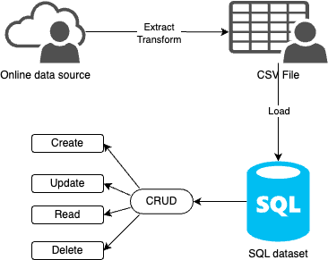

# Mini-Project 5  TianjiRao
## SQLite Python CRUD

## Purpose
The purpose of this project is to create CRUD actions using SQLite and Python, and to build an ETL-query pipeline. Here, we use `alcohol.csv` as a sample dataset, convert it to a `.db` file, and conduct CRUD actions (with queries) on it.

## Workflow

## Perparation
1. Create: create a new codespaces with all required packages loaded.   
2. Extract data `make extract`: Extract `alcohol.csv` data from the url.     
3. Transform and load data `make transform_load`: connect the `alcohol.csv` file to the `alcoholDB.db` using SQLite.

## Actions 
1. **Format**: `make format`    
2. **Lint**: `make lint`    
3. **Test**: `make test`

## Tests
### CRUD Actions
1. **Create**   
Create a new record using `create_record()`: 
python main.py update_record 1000 country_A 1 1 1 1.1

2. **Read** 
Read all data using `read_data()`:   
python main.py read_data

3. **Update**   
Update a raw with primary key 3 using `create_record`:  
python main.py update_record 3 country_A 10 10 10 10

4. **Delete**   
Delete one record with primary key 1 using `delete_record()`: 
python delete_record 1

## Reference
https://github.com/nogibjj/sqlite-lab